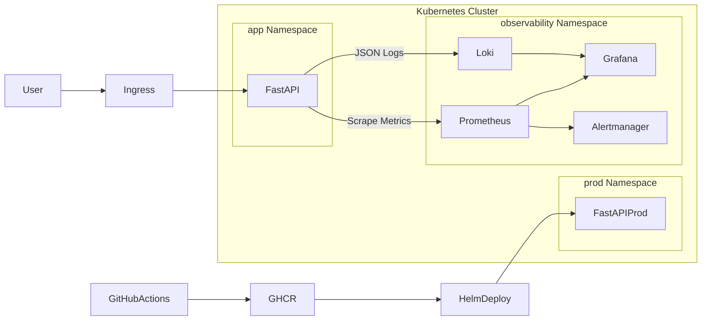

# Kubernetes Observability Project – FastAPI, Prometheus, Grafana, Loki, Alertmanager, HPA & GitHub Actions

## 1. Project Overview
This project implements a complete production-grade **Kubernetes Observability Platform** for a FastAPI application.  
It demonstrates essential **DevOps** and **Site Reliability Engineering (SRE)** practices such as containerisation, metrics instrumentation, logging pipelines, alerting workflows, autoscaling, GitHub Actions CI/CD, and multi-environment Kubernetes deployments.

The goal is to simulate a real-world production monitoring environment that highlights readiness for DevOps, Cloud Engineering, and SRE roles.

---

## 2. Architecture Summary
The architecture consists of three Kubernetes namespaces:

- **app** : development and testing  
- **prod** : production-like environment  
- **observability** : monitoring stack including Prometheus, Grafana, Loki, Alertmanager

### Core Flow
- User → FastAPI → Kubernetes cluster  
- Prometheus scrapes metrics from FastAPI  
- Grafana visualises metrics and logs  
- Loki stores JSON-structured FastAPI logs  
- Alertmanager delivers alert notifications  
- GitHub Actions performs CI/CD into `prod`  



---

## 3. Features
- FastAPI deployed via Helm  
- Prometheus scraping using pod annotations  
- JSON structured logging integrated with Loki  
- Grafana dashboards for latency, usage, traffic, restarts  
- Alertmanager + email notifications  
- CPU-based HPA autoscaling  
- GitHub Actions CI/CD deployment  
- Multi-environment Kubernetes namespaces  

---

## 4. Tech Stack
- **FastAPI**
- **Docker**
- **Kubernetes (K8s)**
- **Helm**
- **Prometheus**
- **Grafana**
- **Loki**
- **Alertmanager**
- **GitHub Actions**
- **GitHub Container Registry (GHCR)**
- **Horizontal Pod Autoscaler (HPA)**

---

## 5. Kubernetes Deployment Structure

### Namespaces
- `app`
- `prod`
- `observability`

### Services
- FastAPI Service (port 80)
- Prometheus, Grafana, Loki internal services

### Helm Values
- Replica counts  
- Resource limits  
- HPA settings  
- Environment-specific image tags  

---

## 6. Observability Stack

### Metrics – Prometheus
- Scrapes `/metrics` endpoint  
- Tracks resource usage (CPU, memory)  
- Custom metrics:
  - `http_requests_total`
  - `http_request_duration_seconds`

### Logging – Loki
- JSON logs emitted by FastAPI  
- Viewed in Grafana Explore  
- Filtered using:
  ```
  {app="fastapi"}
  ```

### Dashboards – Grafana
- Request breakdown  
- Latency (avg, p90, p99)  
- Pod restarts  
- Traffic & health  
- Resource usage  

### Alerting – Alertmanager
HighPodRestartRate alert:

```
expr: increase(kube_pod_container_status_restarts_total[5m]) > 0
for: 1m
severity: warning
```

Alerts transition correctly between inactive → pending → firing → resolved.

---

## 7. Autoscaling (HPA)
HPA configured based on CPU.

Scaling tested using:

```
/burn
```

Scaling validated using:

```
kubectl get hpa -n app
kubectl get pods -n app
```

---

## 8. CI/CD Pipeline (GitHub Actions)
Pipeline performs:

1. Build FastAPI Docker image  
2. Push image to GHCR  
3. Authenticate to Kubernetes  
4. Deploy with Helm  

---

## 9. Local Development
Run locally:

```
uvicorn app.main:app --reload
```

Build container:

```
docker build -t fastapi-observability:local .
```

---

## 10. Deployment Instructions

Install:

```
helm install fastapi ./helm/fastapi -n app
```

Upgrade:

```
helm upgrade fastapi ./helm/fastapi -n app
```

Uninstall:

```
helm uninstall fastapi -n app
```

---

## 11. Folder Structure
```
.
├── app/
├── helm/
│   └── fastapi/
│       ├── templates/
│       ├── values.yaml
│       ├── values-prod.yaml
├── .github/workflows/
│   └── deploy.yaml
├── Dockerfile
└── README.md
```

---

## 12. Screenshots & Demo Evidence

### 📌 Grafana – Loki Logs (JSON Structured Logs)


### 📌 Grafana – Request Breakdown


### 📌 Grafana – Resource Usage (CPU & Memory)


### 📌 Grafana – Latency p90/p99


### 📌 Grafana – Pod Restarts & Traffic


### 📌 Alertmanager Email – Firing


### 📌 Alertmanager Email – Resolved


### 📌 HPA Scaling During Load Test
  
  
  


### 📌 Load Generation Script Used


### 📌 Production Namespace Deployment


### 📌 GitHub Actions – CI/CD Pipeline Run


---

## 13. Results & What I Acheived
This project simulates real-world DevOps and SRE capabilities:

- Built full observability into a microservice  
- Deployed and managed Kubernetes workloads  
- Configured alerting rules and monitoring health  
- Automated releases via CI/CD  
- Used HPA to maintain availability under load  
- Implemented structured logging with Loki  
- Managed dev/prod environments with Helm  

---

## 14. Future Improvements
- Distributed tracing (Tempo or Jaeger)  
- Error budgets and SLOs  
- Canary/Blue-Green deployments  
- Ingress improvements  
- More detailed dashboards  

---

## 15. Contact
- **LinkedIn:** https://www.linkedin.com/in/oluwaseyi-abiola  
- **GitHub:** https://github.com/Larriephill  
